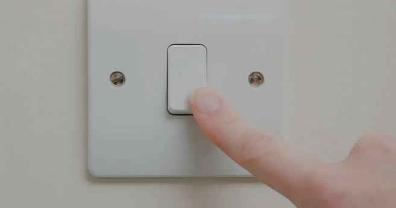
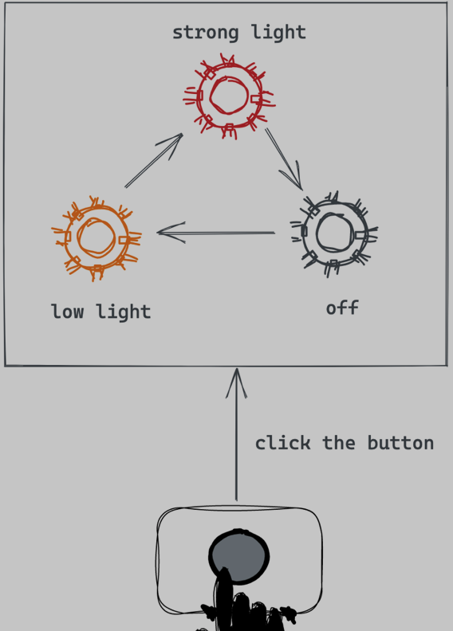
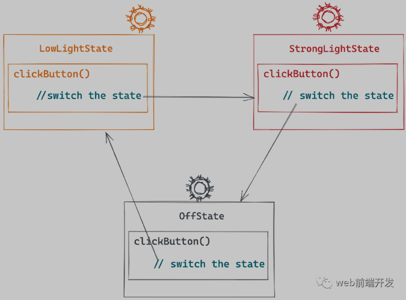
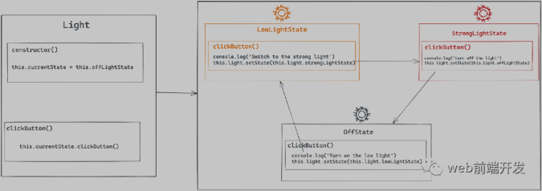
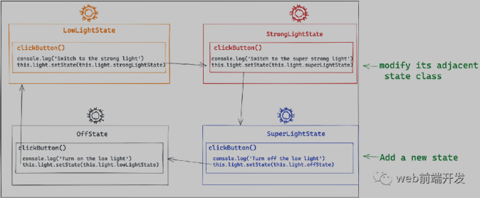

状态模式是一个有趣的模式，它可能是解决一些需求场景的最佳方式。虽然状态模式不是一种易于学习的模式（它通常会导致代码量增加），但一旦您了解了状态模式的本质，您将在未来感谢它无与伦比的好处。

网上很多文章在解释状态模式时，都过于理论化，难以理解。这里我尝试用一个实际案例用通俗易懂的方式来解释。

## 1. 打开/关闭灯



让我们想象一个场景，其中有一盏灯只有一个开关。

* 灯亮时按下开关，灯将关闭。

* 再按一下开关，灯就亮了。

我们可以发现一个特点：同一个开关按钮在不同的状态下会有不同的行为。
现在让我们编写一段代码来模拟灯光，并打开和关闭灯光，如何编写代码？

一个简单的实现：

```js
class Light{
  constructor() {
    this.state = 'off'
  }

  clickButton() {
    if (this.state === 'off') {
      console.log('turn on the light')
      this.state = 'on'
    } else if (this.state === 'on') {
      console.log('turn off the light')
      this.state = 'off'
    }
  }
}
```
## 2. 多态

在上面的场景中，灯只有两种状态，所以代码写起来比较简单。

但我们需要知道，在现实生活中，很多物体都有两种以上的状态，一旦一个对象有更多的状态，它就会更麻烦。

例如，有些手电筒具有三种状态：

* 关闭状态

* 弱光状态

* 强光状态

第一次按下开关打开弱光，第二次按下打开强光，第三次按下关闭灯。



现在让我们模拟这样的行为，我们应该如何写代码？

正常的解决方案是扩展前面的代码，在clickButton方法中进行一些额外的状态判断和状态切换。

```js
class Light{
  constructor() {
    this.state = 'off'
  }

  clickButton() {
    if (this.state === 'off') {
      console.log('turn on the low light')
      this.state = 'lowLight'
    } else if (this.state === 'lowLight') {
      console.log('switch to the strong light')
      this.state = 'strongLight'
    } else if (this.state === 'strongLight') {
      console.log('turn off the light')
      this.state = 'off'
    }
  }
}
```

虽然这样的代码可以满足要求，但它有很多缺点。

* 如果以后需要添加或者修改Light的状态，那么就需要不断的修改clickButton方法，使得clickButton不稳定，不符合开闭原则。

* 同时，所有与状态相关的行为都放在了clickButton方法中，不符合单一职责原则。如果以后加入新的状态，比如superStrongLight，clickButton方法会越来越臃肿。

* 最后，状态之间的切换完全依赖于在 clickButton 方法中堆叠 if 和 else 语句。添加或修改状态可能需要更改多个操作，这使得该方法更难以阅读和维护。

## 4. 分析

让我们回想一下，我们的代码使用 Light 作为一个单独的对象，然后它具有三种状态。然后我们需要让它在不同的状态之间切换，我们将不同的状态视为光的内部属性。

但实际上，我们可以打破惯性思维，将每一个状态都视为一个独立的存在，封装成一个单独的类。

比如这里的灯有三种状态：

* 低光状态

* 强光状态

* 关闭状态

不同状态的灯有自己的行为特征。

LowLightState 的clickButton 方法将状态切换为StrongLightState，StrongLightState 的clickButton 将状态切换为OffState。



而我们的Light只需要关注它处于什么状态，不需要处理状态切换，状态切换由每个状态自己处理。

一下是完整代码

```js
 class OffLightState {
    constructor(light) {
      this.light = light
    }

    clickButton() {
      console.log('Turn on the low light')
      this.light.setState(this.light.lowLightState)
    }
  }

  class LowLightState {
    constructor(light) {
      this.light = light
    }

    clickButton() {
      console.log('Switch to the strong light')
      this.light.setState(this.light.strongLightState)
    }
  }

  class StrongLightState {
    constructor(light) {
      this.light = light
    }

    clickButton() {
      console.log('turn off the light')
      this.light.setState(this.light.offLightState)
    }
  }
  class Light{
    constructor() {
      this.offLightState = new OffLightState(this);
      this.lowLightState = new LowLightState(this);
      this.strongLightState = new StrongLightState(this);
      this.currentState = this.offLightState
    }

    setState(newState) {
      this.currentState = newState
    }

    clickButton() {
      this.currentState.clickButton()
    }
  }

  let light = new Light()
  light.clickButton()
  light.clickButton()
  light.clickButton()
```
图解:



这样的代码可以解决前面提到的问题：
轻物体更简单。它只需要调用this.currentState.clickButton()，状态切换可以由状态对象自己处理。

如果将来有新的状态，我们只需要创建一个新的状态类，然后修改其相邻的状态类，而不需要对现有代码进行大量修改。



这种编写代码的技术就是状态模式。

## 5.状态模式的正式定义：

状态模式是一种行为软件设计模式，它允许对象在其内部状态发生变化时改变其行为。这种模式接近于有限状态机的概念。状态模式可以解释为策略模式，它能够通过调用模式接口中定义的方法来切换策略。

简单来说，如果你的对象有多个状态，并且不同状态的对象表现不同，那么你可以考虑使用状态模式。

状态模式有时会增加代码行数，但代码的质量并不取决于代码行数。使用状态模式通常可以使您的对象的逻辑更加简洁。