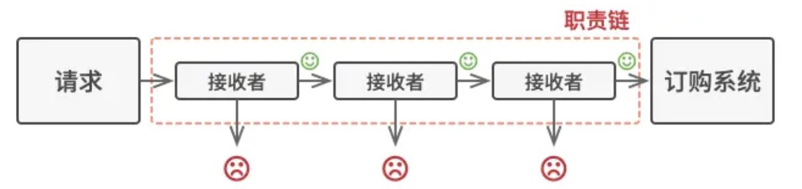

## 1. 什么是责任链

责任链模式是一种行为设计模式， 允许你将请求沿着处理者链进行发送。收到请求后， 每个处理者均可对请求进行处理， 或将其传递给链上的下个处理者。




## 2. 使用场景

责任链的使用场景还是比较多的：

* 多条件流程判断：权限控制

* ERP 系统流程审批：总经理、人事经理、项目经理

## 3. 案例

假设现在有一个闯关游戏，进入下一关的条件是上一关的分数要高于 xx：

* 游戏一共 3 个关卡

* 进入第二关需要第一关的游戏得分大于等于 80

* 进入第三关需要第二关的游戏得分大于等于 90

那么代码可以这样写：
```js

//第一关  
class FirstPassHandler {
  handler(){  
    console.log("第一关-->FirstPassHandler");  
    return 80;  
  }  
}  
  
//第二关  
class SecondPassHandler {
  handler(){  
    console.log("第二关-->SecondPassHandler");  
    return 90;  
  }  
}  
  
  
//第三关  
class ThirdPassHandler {
  handler(){  
    console.log("第三关-->ThirdPassHandler，这是最后一关啦");  
    return 95;  
  }  
}

function run () {
  // 第一关
  const firstPassHandler = new FirstPassHandler();
  // 第二关
  const secondPassHandler = new SecondPassHandler();
  // 第三关
  const thirdPassHandler = new ThirdPassHandler();

  const firstScore = firstPassHandler.handler();  
  //第一关的分数大于等于80则进入第二关  
  if(firstScore >= 80){  
      const secondScore = secondPassHandler.handler();  
      //第二关的分数大于等于90则进入第二关  
      if(secondScore >= 90){  
          thirdPassHandler.handler();  
      }  
  }  
}
run()
```
那么如果这个游戏有 100 关，我们的代码很可能就会写成这个样子：
```js
if(第1关通过){  
    // 第2关 游戏  
    if(第2关通过){  
        // 第3关 游戏  
        if(第3关通过){  
           // 第4关 游戏  
            if(第4关通过){  
                // 第5关 游戏  
                if(第5关通过){  
                    // 第6关 游戏  
                    if(第6关通过){  
                        //...  
                    }  
                }  
            }   
        }  
    }  
}
```
这种代码不仅冗余，并且当我们要将某两关进行调整时会对代码非常大的改动，这种操作的风险是很高的，因此，该写法非常糟糕。


## 4. 初步改造

如何解决这个问题，我们可以通过链表将每一关连接起来，形成责任链的方式，第一关通过后是第二关，第二关通过后是第三关....

```js
//第一关  
class FirstPassHandler {
  play () {
    return 80
  }
  setNext (next) {
    this.next = next
  }
  handler(){  
    console.log("第一关-->FirstPassHandler");
    const socre = this.play()
    // 分数>=80 并且存在下一关才进入下一关  
    if (socre >= 80 && this.next !== null) {
      return this.next.handler()
    }
    return socre
  }  
}  
  
//第二关  
class SecondPassHandler {
  play () {
    return 90
  }
  setNext (next) {
    this.next = next
  }
  handler(){  
    console.log("第二关-->SecondPassHandler");  
    const socre = this.play()
    // 分数>=90 并且存在下一关才进入下一关  
    if (socre >= 90 && this.next !== null) {
      return this.next.handler()
    }
    return socre
  }  
}  
  
  
//第三关  
class ThirdPassHandler {
  play () {
    return 95
  }
  setNext (next) {
    this.next = next
  }
  handler(){  
    console.log("第三关-->ThirdPassHandler，这是最后一关啦");  
    return 95;
  }  
}

function run () {
  // 第一关
  const firstPassHandler = new FirstPassHandler();
  // 第二关
  const secondPassHandler = new SecondPassHandler();
  // 第三关
  const thirdPassHandler = new ThirdPassHandler();

  firstPassHandler.setNext(secondPassHandler)
  secondPassHandler.setNext(thirdPassHandler)

  firstPassHandler.handler();  
}
run()
```

## 5. 改造

我们可以看一个关卡中都存在`下一个关卡对象 next`，所以我们可以抽象出一个父类构造对象，然后每个关卡去继承这个构造对象
```js
class AbstractChain {
  constructor () {
    this.next = null
  }
  setNext (next) {
    this.next = next
  }
}
```
最后我们可以将代码改成这样
```js
//第一关  
class FirstPassHandler extends AbstractChain {
  play () {
    return 80
  }
  handler(){  
    console.log("第一关-->FirstPassHandler");
    const socre = this.play()
    // 分数>=80 并且存在下一关才进入下一关  
    if (socre >= 80 && this.next !== null) {
      return this.next.handler()
    }
    return socre
  }  
}  
  
//第二关  
class SecondPassHandler extends AbstractChain {
  play () {
    return 90
  }
  setNext (next) {
    this.next = next
  }
  handler(){  
    console.log("第二关-->SecondPassHandler");  
    const socre = this.play()
    // 分数>=90 并且存在下一关才进入下一关  
    if (socre >= 90 && this.next !== null) {
      return this.next.handler()
    }
    return socre
  }  
}  
  
  
//第三关  
class ThirdPassHandler extends AbstractChain {
  play () {
    return 95
  }
  setNext (next) {
    this.next = next
  }
  handler(){  
    console.log("第三关-->ThirdPassHandler，这是最后一关啦");  
    return 95;
  }  
}

function run () {
  // 第一关
  const firstPassHandler = new FirstPassHandler();
  // 第二关
  const secondPassHandler = new SecondPassHandler();
  // 第三关
  const thirdPassHandler = new ThirdPassHandler();

  firstPassHandler.setNext(secondPassHandler)
  secondPassHandler.setNext(thirdPassHandler)

  firstPassHandler.handler();  
}
run()
```

## 6. 总结
案例很简单，代码也很简单，仅是为了体现设计模式的作用。

本案例的`handler`其实也可以考虑抽出，然后实例去重写父类的`handler`就行了，但是考虑到案例的简单性，这里就不在抽离了，理解精华就好。

还是那句话，不要为了用设计模式，而不去充分考虑业务的适用性，否则设计模式可能会把简单的业务给复杂化。