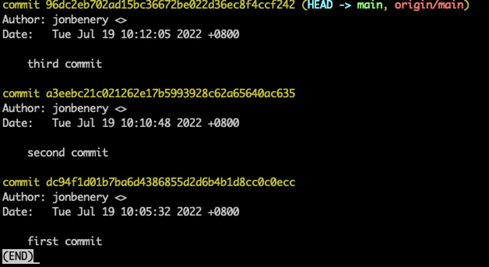
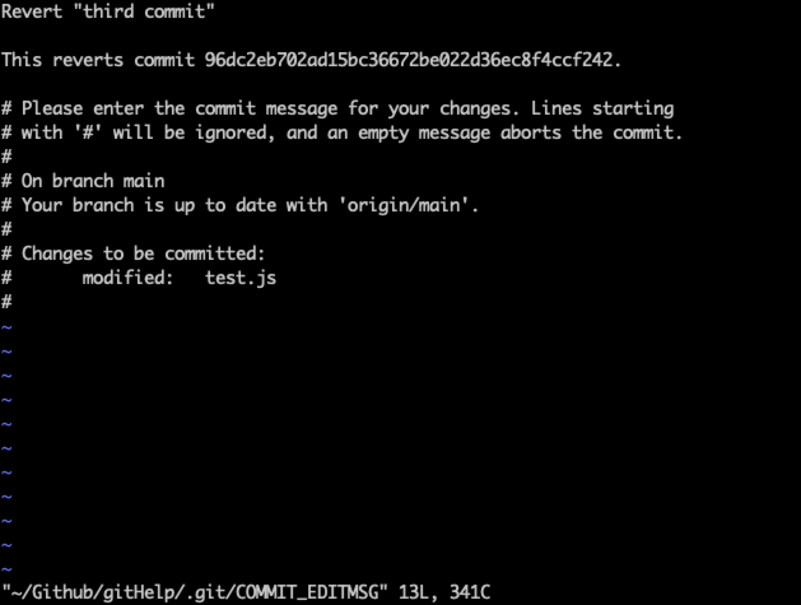
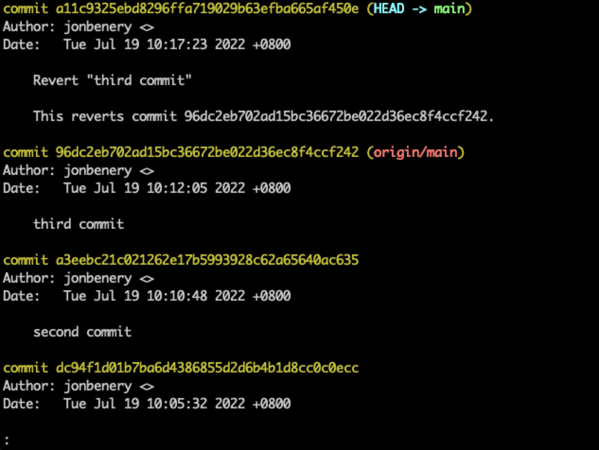

使用 Git 作为代码版本管理，早已是现在开发工程师必备的技能。可大多数工程师还是只会最基本的保存、拉取、推送，遇到一些commit管理的问题就束手无策，或者用一些不优雅的方式解决。

## 1. stash
【官方文档】 [https://git-scm.com/docs/git-stash](https://git-scm.com/docs/git-stash)

【Git教程】 [https://www.bookstack.cn/read/git-tutorial/docs-commands-git-stash.md](https://www.bookstack.cn/read/git-tutorial/docs-commands-git-stash.md)

官方解释：
>当您想记录工作目录和索引的当前状态，但又想返回一个干净的工作目录时，请使用git stash。该命令将保存本地修改，并恢复工作目录以匹配头部提交。


stash 命令能够将还未 commit 的代码存起来，让你的工作目录变得干净。

### 1.2 应用场景
我猜你心里一定在想：为什么要变干净？

应用场景：某一天你正在 feature 分支开发新需求，突然产品经理跑过来说线上有bug，必须马上修复。而此时你的功能开发到一半，于是你急忙想切到 master 分支，然后你就会看到以下报错：

```powershell
error: Your local changes to the following files would be overwritten by checkout:
    src/entries/index/config/groups.js
Please commit your changes or stash them before you switch branches.
Aborting
```

因为当前有文件更改了，需要提交commit保持工作区干净才能切分支。由于情况紧急，你只有急忙 commit 上去，commit 信息也随便写了个“暂存代码”，于是该分支提交记录就留了一条黑历史...(真人真事，看过这种提交)

### 1.3 命令使用
如果你学会 stash，就不用那么狼狈了。你只需要：
```powershell
git stash
```

就这么简单，代码就被存起来了。

当你修复完线上问题，切回 feature 分支，想恢复代码也只需要：
```powershell
git stash apply
```

### 1.4 相关命令
```powershell
# 保存当前未commit的代码
git stash

# 保存当前未commit的代码并添加备注
git stash save "备注的内容"

# 列出stash的所有记录
git stash list

# 删除stash的所有记录
git stash clear

# 应用最近一次的stash
git stash apply

# 应用最近一次的stash，随后删除该记录
git stash pop

# 删除最近的一次stash
git stash drop
```

当有多条 stash，可以指定操作stash，首先使用stash list 列出所有记录：

```powershell
git stash list
stash@{0}: WIP on ...
stash@{1}: WIP on ...
stash@{2}: On ...
```
应用第二条记录：
```powershell
git stash apply stash@{1}
```
pop，drop 同理。

## 2. reset --soft

回退你已提交的 commit，并将 commit 的修改内容放回到暂存区。

一般我们在使用 `reset` 命令时，`git reset --hard` 会被提及的比较多，它能让 `commit` 记录强制回溯到某一个节点。而 `git reset --soft` 的作用正如其名，`--soft` (柔软的) 除了回溯节点外，还会保留节点的修改内容。

### 2.1 应用场景
回溯节点，为什么要保留修改内容？

应用场景1：有时候手滑不小心把不该提交的内容 commit 了，这时想改回来，只能再 commit 一次，又多一条“黑历史”。

应用场景2：规范些的团队，一般对于 commit 的内容要求职责明确，颗粒度要细，便于后续出现问题排查。本来属于两块不同功能的修改，一起 commit 上去，这种就属于不规范。这次恰好又手滑了，一次性 commit 上去。

### 2.2 命令使用

```powershell
# 恢复最近一次 commit
git reset --soft HEAD^
```
`reset --soft` 相当于后悔药，给你重新改过的机会。对于上面的场景，就可以再次修改重新提交，保持干净的 commit 记录。

以上说的是还未 push 的commit。对于已经 push 的 commit，也可以使用该命令，不过再次 push 时，由于远程分支和本地分支有差异，需要强制推送 `git push -f` 来覆盖被 reset 的 commit。

还有一点需要注意，在 `reset --soft` 指定 commit 号时，会将该 commit 到最近一次 commit 的所有修改内容全部恢复，而不是只针对该 commit。


## 3. cherry-pick
给定一个或多个现有提交，应用每个提交引入的更改，为每个提交记录一个新的提交。这需要您的工作树清洁（没有从头提交的修改）。
即将已经提交的 commit，复制出新的 commit 应用到分支里

### 3.1 应用场景
commit 都提交了，为什么还要复制新的出来？

应用场景1：有时候版本的一些优化需求开发到一半，可能其中某一个开发完的需求要临时上，或者某些原因导致待开发的需求卡住了已开发完成的需求上线。这时候就需要把 commit 抽出来，单独处理。

应用场景2：有时候开发分支中的代码记录被污染了，导致开发分支合到线上分支有问题，这时就需要拉一条干净的开发分支，再从旧的开发分支中，把 commit 复制到新分支。

### 3.2 命令使用
```
git cherry-picker commitId[记录的id]
```

复制多个
```
git cherry-picker commitId1 commitId2
```
上面的命令将 commitId1 和 commitId2 两个提交应用到当前分支。

多个连续的commit，也可区间复制：
```
git cherry-picker commitId1^..commitId2
```
上面的命令将 commitId1 到 commitId2 这个区间的 commit 都应用到当前分支（包含commitId1、commitId2），commitId1 是最早的提交。


## 4. revert
给定一个或多个现有提交，恢复相关提交引入的更改，并记录一些这些更改的新提交。这就要求你的工作树是干净的（没有来自头部的修改）。
即将现有的提交还原，恢复提交的内容，并生成一条还原记录。

### 4.1 应用场景
应用场景：有一天测试突然跟你说，你开发上线的功能有问题，需要马上撤回，否则会影响到系统使用。这时可能会想到用 reset 回退，可是你看了看分支上最新的提交还有其他同事的代码，用 reset 会把这部分代码也撤回了。由于情况紧急，又想不到好方法，还是任性的使用 reset，然后再让同事把他的代码合一遍（同事听到想打人），于是你的技术形象在同事眼里一落千丈。

### 4.2 命令使用
revert 普通提交

学会 revert 之后，立马就可以拯救这种尴尬的情况。

现在 Main 记录如下：



  ```powershell
  git revert 96dc2eb702ad15bc36672be022d36ec8f4ccf242
  ```
  revert 掉第三次提交的 commit。



因为 revert 会生成一条新的提交记录，这时会让你编辑提交信息，编辑完后 :wq 保存退出就好了。



再来看下最新的 log，生成了一条 revert 记录，虽然自己之前的提交记录还是会保留着，但你修改的代码内容已经被撤回了。

### 4.3 revert 合并提交
在 git 的 commit 记录里，还有一种类型是合并提交，想要 revert 合并提交，使用上会有些不一样。

合并提交可以理解为 `分支合并产生的记录`，它是两个 `分支的交集点`，通常情况我们使用 revert 方法来撤回这次提交是不允许的，会发现命令行报错。

为什么会这样？在官方文档中有解释：
>  通常无法 revert 合并，因为您不知道合并的哪一侧应被视为主线。此选项指定主线的父编号（从1开始），并允许 revert 反转相对于指定父编号的更改

我的理解是因为合并提交是两条分支的交集节点，而 git 不知道需要撤销的哪一条分支，需要添加参数 -m 指定主线分支，保留主线分支的代码，另一条则被撤销。

-m 后面要跟一个 parent number 标识出"主线"，一般使用 1 保留主分支代码。

```powershell
git revert -m 1 <commitHash>
```

## 5. reflog
此命令管理重录中记录的信息。

如果说 `reset --soft` 是后悔药，那 reflog 就是强力后悔药。它记录了所有的 commit 操作记录，便于错误操作后找回记录。

### 5.1 应用场景
某天你眼花，发现自己在其他人分支提交了代码还推到远程分支，这时因为分支只有你的最新提交，就想着使用 `reset --hard`，结果紧张不小心记错了 commitHash，reset 过头，把同事的 commit 搞没了。

没办法，`reset --hard` 是强制回退的，找不到 commitHash 了，只能让同事从本地分支再推一次（同事瞬间拳头就硬了，怎么又是你）。于是，你的技术形象又一落千丈。

### 5.2 命令使用
```powershell
git reflog
```
通过 `git reflog` 我们找到被 `reset` 过头的 commitHash， 然后在通过命令 `git rest` 回滚
```powershell
git rest --hard commitHash
```
然后内容就回去了

文章摘自【前端大全】仅用于学习交流
